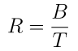
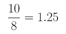
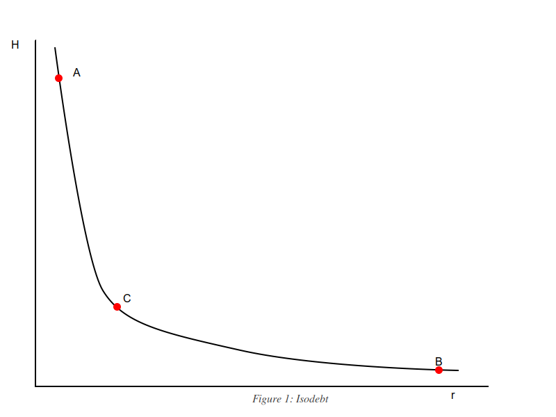
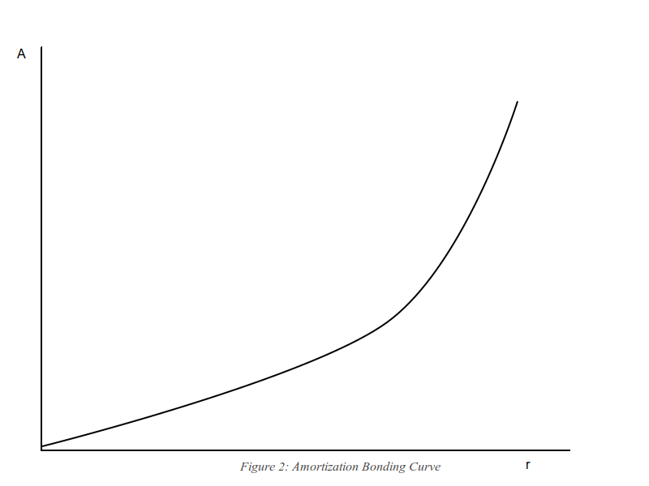

# PyroTokens3

The third phase in Behodler's super deflationary token wrappers.

# Description

PyroTokens are wrapper tokens of existing tokens traded on Behodler, crafted on deflationary tokenomics. The relationship between PyroTokens and Behodler listed tokens is 1 to 1. Eg. WEth has PyroWeth, OXT has PyroOXT and so on. PyroTokens achieve deflationary price movements with respect to their base token by establishing a redeem rate that can only increase. The redeem rate is algorithmically calculated as the total base token in reserve divided by the supply of the PyroToken. In notation, if R is the redeem rate, B the total reserve of base tokens held in a PyroToken contract and T, the total supply of PyroTokens, then the redeem rate is given by the fraction,



EG. Suppose that there are 10 WEth in reserve and the supply of PyroWEth is 8. This implies the redeem rate of PyroWEth is



This means that if you wish to mint 1 PyroWeth, you require 1.25 Eth. Similarly redeeming 1 PyroWEth will give 1.25 Eth.

## The 3 Laws of PyroTokens

The redeem rate equation is given by the fraction B/T. While minting and redeeming leave the fraction unchanged, the numerator and denominator can move independently of one another. However the following contract enforced rules apply:

1. When the denominator changes, the numerator must remain fixed.
2. When the numerator changes, the denominator must remain fixed.

   We can call the above 2 rules independent movements. Then,

3. When an independent movement occurs, the denominator can only decrease and the numerator can only increase, depending on which one is moving.

## Value proposition

Putting those 3 rules together gives a strong guarantee on the redeem rate: it can only increase or stay the same but never decrease. This means that for the purpose of hodling a given token, PyroTokens are strongly superior to their base token. In other words, if you wish to hold Weth, you should hold PyroWEth instead.

### Caveats

In the case where you wish to use the underlying base token for utility purposes such as Eth in transactions or an LP token for unwrapping, the gas costs of moving in and out of the corresponding PyroToken need to be accounted for. Furthermore, PyroTokens exact an exit fee on redemption that should be taken into account such that one should hold PyroTokens until the redeem rate appreciation has compensated for the exit fee. In addition, the usual risk of adopting an extra protocol reply: if you only hold Eth, your protocol risk is limited to the Ethereum platform risk wheras holding PyroWEth exposes you to Behodler protocol risk as well.

## Mechanisms for independent movement

Since independent movements in the components of the redeem rate are the algorithmic mechanisms for increasing the redeem rate, it's worth enumerating the chief causes of their movements:

### Independent numerator increases

Every trade on Behodler levies a 0.5% fee on the input token. For tokens that have PyroTokens, the fee is sent to the corresponding PyroToken reserve, independently increasing the numerator and therefore the redeem rate.

### Independent denominator decreases

The mechanism for decreasing the denominator is burning:

1. Every transfer of the PyroToken incurs a fee, 100% of which is burnt. To use Uniswap's terminology, the transfer fee is _inclusive_.
2. Exiting the PyroToken by redeeming for the base token incurs a burn fee which is higher than the transfer fee.

The purpose of the burn on transfer is to benefit from high frequency AMM trades. By listing the PyroTokens on all the major AMMs including Behodler, regular trade will transfer value to hodlers. This mechanism is part of Behodler's broader MEV capture and underpins the strategy for deepening liquidity. However these topics are beyond the scope of this document and interested readers can dive deeper into the relationship between MEV capture, Limbo and the Behodler AMM by consulting other Behodler documentation.

The purpose of the exit fee is to encourage redeemers to rather go through an AMM to redeem since the transfer fee is less than the exit fee. That is, if possible, swap PyroWEth for Eth on Behodler or any popular AMM rather than trigger the redeem functionality. The exception being small amounts because the redeem functionality consumes less gas than a swap on most AMMs. Furthermore, when there's a market rush to dump the base token, the rush to the exit of PyroToken holders causes the redeem rate to increase for the remainers. This exit fee therefore acts to protect holders from sudden market downturns. PyroTokens are dump proof. As PyroToken TVL grows, this anti dump mechanism will act to partially shield the base token from sudden market downturns, bringing a necessary price smoothing effect to DeFi.

# Why is a new version required?

While theory and well planned code can create great protocols, there's no substitute for experience and PyroTokens are no different. Each iteration of the PyroToken experiment yielded important lessons and as these lessons accumulated, the weight of their suggestive pressure eventually required an upgrade.

## Yield on idle reserves

PyroTokens2 have been a great success but there are some shortcomings that are still holding the experiment back. Since the advent of PyroTokens2, much has occurred in DeFi in the realm of earning yield on idle capital. While simply locking capital was considered a great economic mechanism in 2019, in the age of Aave, Tokemak, Sushi and yield farms in general, DeFi users expect locked capital to be put to work.
There are two major problems with putting underlying capital to work in a DeFi protocol. The first is that it causes the protocol to inherit the security vulnerabilities of the yield protocol employed. For instance, suppose all the WEth in PyroWEth is deposited into a protocol like Curve in order to earn a yield. This would accelerate redeem rate growth. However, an exploit in Curve would kill PyroWeth.
The second problem (and this is a mainnet issue only) is that if all the capital is deployed to earn yield then redeeming and minting will cost an unpalatable amount of gas.
The 3 laws of PyroTokens offer a solution to the above such that the underlying capital can be put to work without increasing the economic risk of the protocol at all. This opportunity cannot be passed up. The mechanism of yield is elaborated <a href ="#pyroloan">is a subsequent section</a>.

## Overly restrictive PyroToken registration rules.

In PyroTokens2, the deployment of a new PyroToken contract is performed in the contract LiquidityReceiver. Here, the PyroToken name is algorithmically generated by tacking on Pyro and P to the name and symbol properties respectively of the base token. For instance, Orchid's OXT token has a PyroToken with the name PyroOrchid and symbol POXT. This strategy (and indeed the code) was borrowed from Aave's Atoken creation contract. Unfortunately, ERC20 doesn't require the name and symbol properties to be provided and as such, a small subset of ERC20 tokens do not have these properties. This means that, when listed on Behodler, they cannot have PyroTokens. MakerDAO's MKR falls into this category. With the advent of PyroTokens3, PyroMKR will be added to the list of available PyroTokens.

In addition to excluding certain tokens, the name generation algorithm suffers from naming every LP token the same thing. This makes for a difficult user experience.
PyroTokens3 will allow for the caller of the creation function to set the name manually. This solves both of the above problems so that on chain, we will see PyroSCX/EYE UniV2 as an example.

**In addition to these necessary upgrades are some friction reducing features gleaned from experience:**

1. Each PyroToken contract maintains a list of addresses that benefit from fee exemptions. This purpose of this is to assist composability for protocols that wish to be built on PyroTokens but which require the spread between prices to be minimized. While it's possible that protocols may seek to exploit the use of this feature, it's important to bear in mind that most burning will come from AMM trades and bots in particular. Furthermore, we can design the requirements for gaining a whitelisting to be a protocol wide bribe. For instance, burning 10000 EYE will whitelist your contract from paying the redeem fee. One of the use cases this feature will enable is allowing any project with a token listed on Behodler to implement a yield earning staking protocol for their user base. For instance, suppose a fictional dapp called DiamondDogs issues the token DD to its user base. DD trades on Behodler and has a corresponding PyroDD. Users who stake DD receive occasional NFT airdrops. When a user stakes DD, the token is converted into PyroDD. When the user unstakes, the PyroDD is unwrapped into DD and returned to the user. By disabling fees for these two operations, DiamondDogs can ensure that in the event when a user rapidly stakes and unstakes, the fees don't incur a liability on the DiamondDogs dapp. However, in order to gain as much yield as possible, the DiamondDogs team has a strong incentive to drive traffic to Behodler so that their PyroToken maximizes on received trade revenue.

2. MintTo and RedeemTo. In PyroTokens2, to mint PyroWEth with ETH, first Eth must be wrapped as WEth and then the WEth should be used to mint PyroWeth. A proxy contract has been deployed to combine these steps into one transaction. However, once the PyroWEth is minted, the proxy contract has to send it to the minting user which incurs a transfer fee. In PyroTokens3, a To address will allow the proxy contract to instruct the PyroTokens to mint directly into the wallet of the recipient.

## Bad transfer etiquette.

In PyroTokens2, the transferFrom function assumes the spender and recipient are the same address which is technically incorrect. The advent of high gas has forced protocols to ensure that this is usually the case. Calling external contracts is expensive so most protocols perform business logic and state changes in the same contract. However, some of the older projects such as Uniswap 2 add an additional logic layer (Router2). When PyroTokens2 are traded through Router2, the transaction fails.
Trading directly with the underlying token pair succeeds which means bots will have little trouble with this detail. However, regular users will not be so fortunate. For the sake of broader DeFi integration, it's essential that all components in Behodler comply with prevailing standards. As such, in addition to removing the incorrect name generating assumptions, the transferFrom should be ERC20 compliant. PyroTokens3 will fix this and therefore be 100% ERC20 compliant in both transfer etiquette and metadata assumptions.

<div id="pyroloan"></div>

# Pyroloans: a revolution in DeFi lending.

The 3 laws of PyroTokens create a certain economic guarantee that cannot be ignored: since PyroTokens cannot fall in value relative to the base token, PyroToken as collateral against base token loans are economically risk free. In traditional collateralized borrowing dapps, there has to be an upper limit on the percentage of loaned token to collateral. For instance, if you wish to deposit Eth on Aave in order to borrow dai, you will only be able to borrow about 70% of the value of your Eth deposit. This is to give liquidators a margin of error in which to protect the protocol from insolvency. Pyroloan collateral staked in order to borrow base token liquidity cannot ever be insolvent which means that this ratio can be much closer to 100%.

## Interest rate policy and some new cryptoeonomics

Why does the lack of insolvency from collateral price movements matter? It means that liquidation from market price movements can't exist on a Pyroloan. Instead, the only thing that can cause liquidation is if the accumulated interest plus the original debt exceeds the original collateral.
However, even this isn't a strong requirement. Consider the following example:
1 PyroWEth is worth 1 Eth for simplicity. Suppose I stake 100 PyroWEth and borrow 60 Eth. The interest rate is non zero and so interest gradually accumulates. Eventually the accumulated interest obligations exceeds 40 Eth. This means there is more outstanding debt than collateral. It would seem on the surface that this should require an immediate liquidation to protect the protocol. However, the interest isn't owed to any user in particular but the protocol as a whole. Indeed the interest doesn't exist until it is paid. As far as the protocol is concerned, 100 PyroWEth has been staked and 60 Eth has been borrowed. If we burn 60 PyroWEth as an act of liquidation, the redeem rate will tick up slightly and the debt and collateral will cancel. It doesn't matter if the interest obligation is 100000 Eth. it has no bearing on the health of the protocol.
Contrast this with protocols that connect user deposits with debtor loans like full reserve Rothbardian banks operating on a blockchain. Here interest is paid to depositors from loan repayments. If those loans begin to fail, interest paid to borrowers has to decline. If enough loans fail, the deposits themselves are in jeopardy. With PyroTokens, each loan is denominated in the collateral put up by the borrower rather than _against_ it. The risk is completely ringfenced within the financial welfare of that borrower. But because we're dealing with PyroTokens, the gains are shared by all holders of the PyroToken in question.

Since individual borrowers can in theory accumulate infinite debt without endangering the system, positive interest rates have no bearing on the incentive for the borrower to repay. An analogy would be how the Japanese government is able to sustain a national debt many times greater than its GDP. Since Japanese private savings are so high, the government is borrowing from its own people to reduce taxation on its people. There are distributional implications but the Yen is not put under strain by increasing foreign obligations. Unless the Japanese government self imposes a debt payoff timeline, this position has no end in sight.
Similarly with Pyroloans, we wish to avoid the situation where borrowers accumulate such large interest burdens that it would make more sense for borrowers to simply abandon their position. A fixed timeline on loans should be added to enforce repayment. If we define a loan by its maturation date, then an implicit interest rate emerges. Technically it's not an interest rate, since the repayment includes interest and payments on principal. So the entire loan obligation is amortized over the fixed duration. For brevity, we'll refer to the average annual repayment required as the repayment rate, or just rate.
For instance, suppose the timeline to repay a Pyroloan is 10 years. And suppose the borrower repays the loan in equal annual installments. This implies an annual rate of 10% per annum on the original debt. If we shorten the repayment period to 5 years then the rate doubles to 20% per annum.

If we set the period of repayment to less than a year then the rate is by definition greater than 100% per annum because 100% of the debt has to be repaid within less than a year.

By controlling the rate through the maturation date, we can create an amortization rate bonding curve where a user can select their interest rate based on the duration of the pyroloan.
Consider the diagram below



The horizontal axis, r, represents the ratio of debt to collateral.The vertical axis represents the lifetime of the loan in hours. The rule is that if a borrower takes more relative capital as a loan, they should be made to pay it back sooner to compensate the protocol for lent out reserves. Similarly, if the user takes out a small loan relative to their staked PyroTokens, the duration until the loan falls due should be longer. This creates the curve, given by

```
rH = k
```

where k is a constant. We'll label this curve the isodebt curve. Moving within the isodebt curve affects the interest you pay. suppose point A represents a 5% loan due in 8760 hours. This means rH = 0.05x8760 = 438.  
8760 happens to be the number of hours in a year so the rate is exactly 100%. That is, 100% of the loan is due in exactly one year. The rate as measured against the staked collateral is 5%.
Now suppose point B represents a loan of 70% of capital. We can calculate how much time this loan requires to be paid because we know k is 438. H = 438/0.7 = 625.71 which is 26 days. Borrowing more relative to the stake shortens the loan duration.
If we calculate the annual rate using a simple interest formula since there is no debt compounding in this scenario then we get (0.7/26)\*365 = 9.82 = 982%.

## Repayment schedule

Recall that a loan is not called until the duration is over. If a user borrows 70% and expects to pay a rate of 982% per annum then they may just incur the default rather than pay such a high rate. So the smart contract should be written such that if a user makes a payment before the due date, the loan is recalculated to reflect a lower interest rate. In other words, the rate is set by an amortization bonding curve (ABC). As the borrower increases their debt, the rate rises and as they decrease their debt the rate falls. Also, by implication, as the debt obligation is paid off, the duration to liquidation increases. In other words, paying off debt is a way for the borrower to buy time in the literal sense of the word buy. Figure 2 shows how the required annual repayment rate, given by vertical axis A, increases as the loan size increases relative to capital, given by the same horizontal axis as in figure 1. This graph is analogous to a graph of slippage from an AMM, except that the thing slipping is the ease of loan repayment.



## Policy instruments for MorgothDAO

Return to the isodebt formulation which is used to determine the repayment rate (r) in the equation: rH = K. While the relationship between r and H is algorithmic, the choice of the value of K is completely arbitrary. It should also be noted that the relationship between K and the rate for any given level of debt is inverse. In other words, in the example above, K is 438 and the annual rate on debt equal to 0.05% of collateral is 100%. Suppose we set the value of K to be 900. Then H will be 900/0.05 = 18000 hours which is 2.5 years. The annual simple interest rate would then fall to 0.05/2.5 = 2.4%.

We could let the community set the value of K through governance decisions routinely to control the across the board interest rate on all loans. This in turn would control how much debt is taken out in aggregate as a proportion of capital. For instance, if the total value of Pyroloans by all borrowers equals 80% of capital for K=1000 then setting K to 500 will cause interest rates to rise which may prompt existing borrowers to either pay off their debt to reduce their interest rates or allow the debt to be liquidated. This would cause the total debt outstanding to fall below 80%. Conversely if the community sets K to 2000, it would cause interest rates across the curve to fall which would prompt more borrowing.

However, a more elegant approach would be to use a smart contract to automatically adjust K. The community sets a total debt ratio policy target. For instance, suppose the community sets the total debt ratio target to 50%. If the actual total debt goes above 50% then the smart contract would lower the value of K in order to raise the interest rates. Conversely if the debt ratio falls below 50% then the smart contract would raise K in order to lower the interest rate.

## Bridging flash loans

A rational borrower would only take an interest rate that was equal to or below the growth of the staked PyroToken. In this way, they can borrow base token and mint more pyro and know that their collateral base is growing faster than their debt obligation. When the loan falls due, they can pay back the entire debt and unstake their pyro, now owning more pyro than they did initially. Indeed, even if they don't have the funds to pay back the debt, they could construct a flashloan that borrows the necessary base token to clear the entire debt. In the same transaction, the liberated staked PyroTokens can be redeemed and used to pay back the flash loan. The left over base token will be profit.

It's worth repeating and emphasising: Pyroloans will allow the borrower to profitably pay down long term loans with flash loans.

## A natural oracle

Since it is only rational to borrow to the point where rates match redeem rate growth, successful repayments can be used as an onchain approximation of the growth in the redeem rate. Specifically the highest rates successfully paid off by borrowers can be used as an estimate for the redeem rate growth rate. Having an onchain, tamper resistant oracle for PyroToken APY will undoubtedly create downstream composability opportunities for smart contract which wish to perform decisions based on interest rates in the span of a transaction without requiring offchain oracle feeds.

## Economic impact on systemic fragility

Collateral backed borrowing on Ethereum, popularized by MakerDAO and Aave, have allowed self leveraged long positions to be built up by iteratively stacking debt. Essentially a user would deposit a risky token with good prospects such as Eth and borrow a stablecoin with a predictable and manageable interest rate such as Dai. They would only borrow a fraction of the value deposited but it would be used to purchase yet more Eth which is then deposited to borrow more Dai. The net result is to expose the borrower to large quantities of Eth. This very long position is in anticipation of Eth price growth exceeding the debt obligation of Dai plus interest. If correct in their predictions, the debt stack can be eventually unwound, leaving the depositor with more Eth that initially deposited.
In a simple loan, a market downturn would see a certain portion of the borrower's Eth sold onto the open market in order to liquidate the position. For a leveraged long position, a great deal more Eth is sold onto the open market. This increased sell pressure amplifies Eth downturns more than would otherwise would have occurred. Therefore borrowing on the margin increases systemic risk to the economy of the collateral asset.

Pyroloans suffer from no such fragility. When a pyroloan position is insolvent (which can only happen because a loan falls due), the PyroToken collateral is burnt. The corresponding base token that was attached to the PyroToken collateral is released back into the reserve pool rather than being dumped on the open market, reflecting as a higher redeem rate for all PyroToken holders. So the first order effect of a pyroloan liquidation is to benefit all PyroToken holders. Since the PyroToken redeem rate has grown faster than it otherwise would have, the attractiveness of minting the base token into PyroTokens has risen which means the demand for base tokens will rise as this demand induces more PyroToken minting. In contrast to traditional loans, the circulating market supply of base token hasn't increased. So the second order effect of a pyroloan liquidation is to put upward price pressure on the base token. As with the rest of the PyroToken mechanisms, the effect of pyroloans is to dampen bear markets.
With traditional loans, liquidations are to the detriment of all borrowers against- and holders of the collateral token. With pyroloans, holders and solvent borrowers all benefit from liquidations.

## Liquidation Incentives

While it is theoretically possible to allow borrowers to take out 100% loans on their staked PyroTokens, we'd like to create an incentive for liquidation bots to clean up outstanding debt. As such, it would make sense to set the borrowing threshold to less than 100% such as 90%. Then on liquidation, the portion of collateral corresponding to the borrowed base token is burnt and an additional 10% is given to the liquidator.
For instance, suppose I stake 100 PyroWEth and borrow 90 Eth (assume redeem rate of 1). The due date arrives. A liquidator then burns 90 of my PyroWEth and claims the remaining 10. Note that this act will increase the PyroWEth redeem rate so that in practice, the liquidator receives more than 10 Eth worth of PyroWeth.

The PyroToken liquidation market is therefore a key contributor to redeem rate growth for PyroTokens.

## Additional redeem rate support

To keep the explanation as simple as possible, the above explanations included no interest as the adjustable amortization rate, given by the ABC is enough to mediate borrower behaviour, even without charging interest. However, without a positive interest rate, the reserve pool for a PyroToken won't grow from repayments, only from loan defaults. The benefit of adjustable time periods is that it isn't necessary to introduce an additional interest rate dynamic. Instead, simply increasing the burden of repayment by an arbitrary fixed amount will have this effect. In other words, 10% stretched over 5 years is less than 10% per annum but 10% compressed into 3 months is far more than 10% per annum.
Therefore an arbitrary additional fee should be levied on the loan so that the amount repaid exceeds the borrowed amount. This difference will be reflected as a higher redeem rate. The fee can be arbitrary and small such as 1%. The reason the percentage isn't important, as alluded to, is because the loan duration will determine the true annual interest rate. 1% of the debt paid back on a 100 day loan is a lot more than 1% per annum. If 3 successive 100 day loans are repaid, that allows for the same capital to be borrowed and repaid 3 times in one year. The total interest paid into the protocol is 1% of the debt multiplied by 3. Therefore a fixed arbitrary percentage has the effect of a floating market rate because of the duration dynamics inherent to pyroloans. The means that with a simple algorithm with analogous properties to a constant product AMM, we get an interest rate market for free without introducing complex algorithms.

## Putting it all together: Pyroloans heal credit markets

Pyroloans offer an opportunity to derive yield on otherwise dormant PyroToken reserves. The mechanism of interest rate calculation implies that in the long run, the yield generated will match the very best DeFi has to offer to that particular PyroToken. For instance, if the best return on PyroWEth is to stake it on Sushi and that doing so yields a return of 30% APY, then the interest rate on PyroWEth loans will rise to approach 30% APY as borrowers deposit their loans on Sushi.
This gives Behodler the benefit of chasing the best yields without having to make informed governance decisions and without introducing protocol risk to PyroTokens.
The Behodler community can decide how much locked capital to put to work by calibrating the aggregate debt target. The smart contracts will then set K such that total loans adjust to meet the target. Again no external protocol risk is introduced. On a practical note, PyroTokens3 will be governed by a purpose built microDAO similar to LimboDAO. The microDAO will then be owned and controlled by one of the minions of MorgothDAO (Gothmog, king of the Balrogs, seems fitting in my opinion).
Finally, unlike traditional crypto loan defaults which undermine the market for collateral, PyroToken loan defaults actually boost demand for both the base token and the PyroToken, and by extension benefit all the holders of the collateral. Pyroloans are the first debt markets to sustainably offer positive counterpressure to market downturns.

The following table contrasts some important differences between Pyroloans and traditional debt markets on Ethereum such as Aave.

<table>
<thead>
<tr>
<th colspan="2">Loan market comparison</th>
</tr>
<tr>
<th>Traditional</th>
<th>PyroLoan</th>
</tr>
</thead>
<tbody>
<tr>
      <td>
         Individual debt risk protocol
      </td>
      <td>
         Individual debt risk is localized
      </td>
</tr>
<tr>
      <td>
         Insolvent positions must be liquidated
      </td>
      <td>
      Insolvent positions are sustainable
      </td>
</tr>
<tr>
      <td>
         Borrowers accept interest rate set by market
      </td>
      <td>
     Borrowers choose interest rate from bonding curve
      </td>
</tr>
<tr>
      <td>
         Borrowed asset must be different to staked asset
      </td>
      <td>
     Borrowed asset must by base token of staked pyrotoken
      </td>
</tr>
<tr>
      <td>
         Debt repayments do not reduce interest rate
      </td>
      <td>
      Debt repayments reduce interest rate
      </td>
</tr>
<tr>
      <td>
         Liquidated debt puts downward price pressure on collateral asset
      </td>
      <td>
      Liquidated debt puts upward price pressure on collateral asset
      </td>
</tr>
<tr>
      <td>
         Liquidation bots receive entire benefit from liquidations
      </td>
      <td>
      All holders of both base token and pyrotoken benefit from liquidations
      </td>
</tr>
<tr>
      <td>
        By lowering the price of collateral, liquidations can cascade into more liquidations, amplifying bear markets
      </td>
      <td>
      Every liquidation improves the health of existing borrowers by raising the price of collateral, helping to stop liquidation waves.
      </td>
</tr>
<tr>
      <td>
        Debt and logic are part of one big protocol, requiring entire protocol to be upgraded when improvements are made
      </td>
      <td>
      Debt and logic are separated allowing loan logic facades to be replaced without affecting existing positions
      </td>
</tr>
</tbody>
</table>

## A final word on external AMMs
While trading of PyroTokens on external AMMs is an excellent source of redeem rate growth, the advent of Pyroloans means that Behodler can generate all the growth PyroTokens need without external assistance. However, PyroToken weaves of LP tokens are still very useful for automining and so the strategy of listing PyroToken weaves on Limbo will still be a dominant ecosystem strategy going forward.

## Protocol safety

<div style="color:red; font-weight: bold">
While Pyroloans offer no economic risk, every new smart contract introduces protocol risk. A loan component is particularly risky to write. As such, the loan component will be inactive by default and will only be turned on through governance. The community is urged to not turn on the loan module until after a full code audit has been conducted.
</div>

## Separation of concerns

The operation of loans will be separated into logic and state. What this means is that each PyroToken contract will maintain a bookkeeping of debt and staked collateral. However, no loan logic will exist other than to enforce debt does not exceed collateral. An external contract called the LoanOfficer will control the logic of loans including the administration of the isodebt relationship and the production of the ABC. What this means is that if a better version of Pyroloans can be designed in the future, the current system can be swapped out for the upgrade without affecting any existing positions. No migrations for existing users or any need for them to be aware of the change. The appointment of LoanOfficer as the debt gatekeeper will be controlled by the microDAO in charge of PyroTokens3.
It should be noted also that each PyroToken can have its own loan officer so we may enter a future with different loan paradigms competing across various PyroTokens. This sort of meta market in governance will certainly create some lockup pressure for EYE.

# Summary of the changes in version 3

1. mint and redeem have recipient addresses to improve DeFi composability and reduce the cost of minting and redeeming PyroWEth in particular.
2. TransferFrom is correctly specified to support indirect routing such as with Uniswap's V2 Router contract.
3. Pyroloans (disabled by default): PyroToken collateral, base token loan.
4. Flexible name generation to allow for tight ERC20 compliant tokens to be made into PyroTokens.
5. Governance controlled whitelisted removal of fees on contracts to assist with DeFi composability.
6. PyroToken contracts will be deployed via CREATE2, using the address of the base token as the salt. This will allow future contracts built on PyroTokens to determined the address of the PyroToken contract without consulting a mapping, reducing the need for a gas expensive SSLOAD operation or an external contract call.
7. Pulling pending fees on mint and redeem can be turned off through governance so that if coupled with a potential future Behodler 3, feature 6 can be taken advantage of, reducing the gas cost further.
8. Tailored to be amenable to registration on Etherscan.

# Migration from version 2

## Existing holders

Existing holders can either manually convert their PyroTokens from version 2 to 3 by first redeeming for the base token and then minting the new token or they can go through a reminting contract that bundles these operations into one. The redeem rates of V2 and V3 are not linked so the final number of PyroTokens may differ significantly. This does not reflect lost or gained value. However, the move from V2 to V3 does imply an unavoidable 2% exit fee from V2.
The introduction of the once off no fee approval would prevent this situation from happening in the future.
The UX for converting V2 to V3 will be as low friction as possible so that new users will not be aware of V2 and V2 holders will be prompted through a single transaction per PyroToken to upgrade.
The option to batch migrate many PyroTokens exits which is cheaper on average than performing 1 transaction per PyroToken.

Note: V2 PyroTokens cannot be disabled but at some point, fee revenue from Behodler will go to V3 PyroTokens exclusively.

## Lessons learnt from prior migrations

Migrations in Ethereum have certain best practices, one of which is to never rely on external state or to make assumptions about state at all. Another it to not store the object being migrated on the migration contract. Instead, the contract should act as a stateless bridge. The V2 to V3 migration will be a purely mechanistic invocation of redeem and mint functionality with no reliance on exchange rates or balances. Indeed, the migration contract is not even aware of which PyroToken is being migrated in particular but simply consults the mappings of the respective Liquidity Receiver contracts.

# Epilogue: The History of PyroTokens

PyroTokens have been a part of Behodler from the very beginning. In fact the concept traces its roots to WeiDai and therefore predates the existence of Behodler. The practical lessons learnt since V1 have informed an incremental improvement in each successive generation. This section briefly outlines the history of PyroTokens.

## V1

When a token was sold on Behodler 1, a portion of the input token would be wrapped into a PyroToken. A percentage of the newly minted PyroToken was then burnt and the remaining quantity sent to the trader, all in the span of 1 transaction.
The intent here was to give traders an immediate stake in the success of the Behodler protocol, similar to loyalty points earned in traditional retail stores.
Early adopters benefit the most since subsequent trade by other users increases the value of existing PyroToken holders. There was no explicit mechanism for users to mint PyroTokens. Instead, trade on Behodler was required.

The drawback to this approach was the gas cost of minting up, burning and then transferring a PyroToken in the span of a trade. When coupled with other features of Behodler 1 such as ephemeral minting of Scarcity, the gas cost of a trade on Behodler 1 exceeded all other popular AMMs.

## V2

Behodler 1 served as a very useful proof of concept AMM so that Behodler 2 could be optimized around gas usage. PyroTokens are no longer minted per trade. Instead a portion of incoming trade is sent to a holder contract called the LiquidityReceiver. This indirect approach leads to significant gas savings on Behodler 2. When minting and redeeming occurs on a PyroToken, pending transfer revenue is fetched from LiquidityReceiver first, similar to the drip() function in Dai's Pot.sol contract.
Borrowing from Aave's generation of ATokens, V2 PyroTokens are given names and symbols derived from the name and symbol properties of the base token. Unfortunately, this precludes certain tokens which do not possess a name or symbol such as MKR.

## V3

The use of a router contract on Uniswap V2 leads to an incompatibility between PyroToken V2 and Uniswap at the level of the front end user. Bots and technical users can still go directly to the underlying pair contracts. External AMM trade is an important feature of the tokenomic interaction between PyroTokens and Limbo and allowing non technical users to route their PyroTokens through external AMMs would reduce UX friction.
Since the advent of V2, DeFi yield opportunities have proliferated, coupled with an increasing emphasis on making capital efficient. V2 reserves were left intentionally idle to protect the protocol from external protocol risk. While it is impossible to protect from the protocol risks of the underlying base tokens, nothing should undermine the 3 Laws of PyroTokens. V3 introduces economic risk free loans that are compliant with the 3 Laws.
Finally, while layer 2 appears to be the future of Ethereum dapps, V3 PyroTokens are still written such that if a Behodler 3 on mainnet were ever deployed, it could be done so with gas cost savings over the existing Behodler (version 2).
